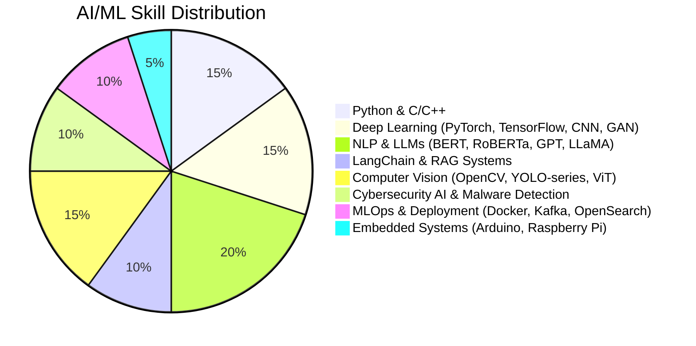

<!-- Profile README for Amal Mirza -->

# 👋 Hi, I'm **Amal Mirza**!

  
AI/ML Engineer | NLP & LLM Researcher | Computer Vision | Cybersecurity AI | Deep Learning

---

## 📃 **About Me**

<table>
  <tr>
    <td>
      I'm an AI/ML Engineer and researcher with an MSc in Computer Engineering, published work in NLP, cybersecurity AI, and computer vision. My work bridges cutting-edge research and production-grade AI systems, with projects spanning zero-day attack detection, LLM-powered applications, medical imaging, and autonomous systems.
      <ul>
        <li>🧑‍🔬 <b>Passionate about:</b> NLP, LLMs, Cybersecurity AI, Computer Vision, Agentic AI, RAG Systems</li>
        <li>🎓 <b>Aspirations:</b> Pursuing a PhD in NLP/AI at a leading international university</li>
        <li>🔗 <a href="https://www.linkedin.com/in/amalmirza/">LinkedIn</a> | <a href="https://github.com/amalmirza">GitHub</a></li>
        <li>📍 Islamabad, Pakistan</li>
        <li>📧 amalmirza055@gmail.com</li>
      </ul>
    </td>
    <td>
      
    </td>
  </tr>
</table>

## 🛠️ **Skills**

> Main tools:
> Python, C/C++, PyTorch, TensorFlow, OpenCV, LangChain, Hugging Face, FAISS, Docker, OpenSearch, Kafka, YARA, Linux, Git

---

## 🧪 **Work Experience Highlights**
- **Software Developer (AI/ML) at Horizon Tech Services** *(Mar 2025 – Present)*
  - Designed multithreaded C++ System Monitoring & Telemetry Agent with Kafka and OpenSearch integration
  - Architected File Malware Detection pipeline combining YARA rules, ML predictions, and cryptographic hashing
- **AI/ML Engineer at NUTECH Incubation Center (NIC)** *(Aug 2024 – Feb 2025)*
  - Deployed production ML models for real-world applications
  - Led AquaSense — AI-powered fecal contamination detection system from prototype to deployment
- **Research Assistant at NCRA SWARM Robotics Lab, UET Taxila** *(Oct 2022 – Jun 2024)*
  - Trained YOLOv5, v6, v7, v9, and YOLO-NAS for underwater trash detection across multiple datasets
  - Contributed to chest X-ray abnormality detection using deep learning for medical imaging

---

## 📦 **Notable Projects**
- 🔐 **ZDBERTa – Zero-Day Cyberattack Detection in IoV** (GAN + RoBERTa/DeBERTa, MDPI 2025)
- 🧠 **Brain Age Prediction from MRI** (3D-CNN, multi-site, 2,072 subjects — Accepted)
- 🤖 **Multi-PDFs ChatApp AI Agent** (LangChain, RAG, Vector Databases)
- 🎨 **AI Image Generation System** (Stable Diffusion, SDXL, ControlNet, DreamShaper)
- 🗣️ **Image-to-Speech GenAI Tool** (Hugging Face, OpenAI API, LangChain)
- 🚗 **Intelligent Driver Assistant System** (Raspberry Pi, Arduino, SIFT, MLP — BSc Thesis)
- 🌊 **Underwater Trash Detection** (YOLO-series, Explainable AI — ICRAI 2024)
- 💬 **LLM Hallucination Study in Finance** (GPT-4, LLaMA-3, Mixtral, RAG evaluation)
- 🌐 **Multilingual Machine Translation** (mBART-50, English–Hindi, English–Tamil)
- 🏃 **Pose Estimation with YOLOv8** (Keypoint localization, facial emotion detection)

---

## 📚 **Publications**
- 📄 **Amal Mirza et al.** "ZDBERTa: Advancing Zero-Day Cyberattack Detection in Internet of Vehicles with Zero-Shot Learning." *MDPI Computers, 2025* ✅
- 📄 **S. Rasheed, Amal Mirza et al.** "Trash Detection in Water Bodies Using YOLO With Explainable AI Insight." *ICRAI 2024* ✅
- 📄 **Amal Mirza et al.** "Brain Age Prediction from MRI Scans Using Deep Learning: A Robust Multi-Site Framework for Neurodegenerative Disease Biomarker Development." *Accepted* ✅
- 📄 **Amal Mirza et al.** "CySBERTA-ZDAD: A LLM-Powered Novel Approach for Zero-Day Attack Detection in IoV with GANs." *Under Review* 🔄

---

## 🏆 **Honours & Awards**
- 🏅 AI Lead, Taxillians Robotics and Automation Club, UET Taxila (Sep 2025)
- 📜 Creating Problem-Solving Agents using GenAI for Action Composition (2024)
- 📜 Building Smarter LLMs with Mamba and State Space Models (2024)
- 📜 Fundamentals of LangChain (2024)
- 📜 Building Intelligent Chatbots using AI (2024)

---

## 🧑‍🎓 **Education**
- **MSc in Computer Engineering** — UET Taxila, Pakistan *(2023–2025)*  
  Thesis: Zero-Day Attack Detection in Internet of Vehicles (IoV) using GANs + LLMs  
  Key courses: ML, Deep Learning, NLP, Computer Vision, Network Security, IoT
- **BSc in Electrical Engineering** — College of Engineering & Technology, Sargodha *(2015–2019)*  
  Thesis: Intelligent Driver Assistant System (Raspberry Pi + Arduino)

---

## 🧑‍💻 **Online Certifications**
- Creating Problem-Solving Agents using GenAI for Action Composition
- Building Smarter LLMs with Mamba and State Space Models
- Fundamentals of LangChain
- Building Intelligent Chatbots using AI

---

## ✨ **Community, Skills & Interests**
- **Languages:** English (Advanced), Urdu (Native)
- **Volunteering:** Fundraiser, UMEED E SUBH, UET Taxila (2023–Present)
- **Skills:** Research, Problem Solving, Teamwork, Technical Writing, Independent Work
- **Tech Interests:** LLMs, Agentic AI, NLP, Cybersecurity AI, Medical Imaging, RAG Systems
- **Hobbies:** 📚 Reading | 👨‍💻 Python Programming | 🔬 AI Research

---

## 📢 **Let's Connect!**
- [💼 LinkedIn](https://www.linkedin.com/in/amalmirza/)
- [🐙 GitHub](https://github.com/Amal-hash-tech)
- [📧 Email](mailto:amalmirza055@gmail.com)
- [🏢 Location: Islamabad, Pakistan]

---

## 🧠 **Favorite Quote**
> "The best way to predict the future is to invent it." – Alan Kay

---

  
  

---

_**Thanks for visiting! Hit the ⭐️ on interesting repos, and let's collaborate on AI for good!**_
